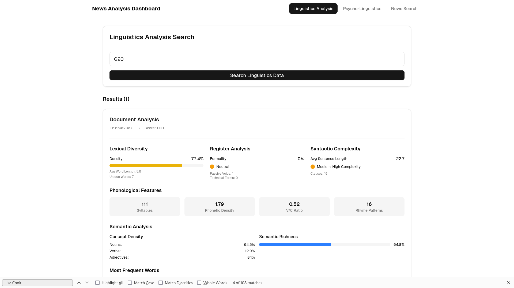
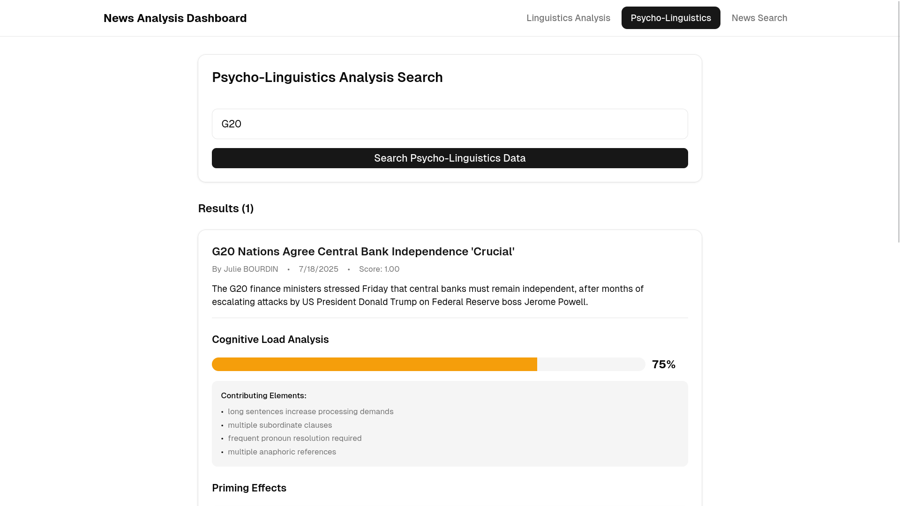

# React Components for News Analysis

This repository contains three React components designed for analyzing news data from different perspectives: Linguistics, Psycho-Linguistics, and general News Search with Visualization.

## Components

### 1. `LinguisticsAnalysis`

-   **Description**: This component allows users to search for news articles and perform a detailed linguistic analysis on the content. It provides insights into lexical diversity, register analysis, syntactic complexity, phonological features, semantic elements, and more.
-   **Key Features**:
    -   Search functionality to query news articles.
    -   Detailed analysis of lexical diversity, including lexical density, average word length, and unique words.
    -   Register analysis, providing formality scores and classification.
    -   Syntactic complexity analysis based on average sentence length and clause analysis.
    -   Visualization of phonological features such as syllable count, phonetic density, and vowel/consonant ratio.
    -   Semantic analysis, including concept density and semantic richness.
    -   Display of the most frequent words and named entities.

### 2. `PsychoLinguisticsAnalysis`

-   **Description**: This component focuses on the psycho-linguistic aspects of news articles, analyzing how they might affect a reader's cognitive processes and emotional responses.
-   **Key Features**:
    -   Search functionality to query news articles.
    -   Cognitive Load Analysis: Assesses the cognitive load of an article, providing a score and a breakdown of contributing elements.
    -   Priming Effects: Identifies potential priming effects within the article.
    -   Working Memory Demands: Highlights the demands the article places on a reader's working memory.
    -   Reader Model Profile: Provides a profile of the likely reader based on the article's content.
    -   Processing Fluency: Evaluates how easily the article can be processed, including factors affecting fluency.

### 3. `NewsSearchVisualization`

-   **Description**: This component enables users to search for news articles and visualize the extracted actions, decisions, and facts related to the query.
-   **Key Features**:
    -   Search functionality to retrieve relevant news data.
    -   Visualization of actions, decisions, and facts extracted from the search results.
    -   Clear presentation of content lists and associated plots for each category.

## Usage

1.  **Installation**:

    ```bash
    # Assuming you are using npm
    npm install
    ```

2.  **Import the components**:

    ```jsx
    import { LinguisticsAnalysis } from "./components/linguistics-analysis";
    import { PsychoLinguisticsAnalysis } from "./components/psycho-linguistics-analysis";
    import { NewsSearchVisualization } from "./components/news-search-visualization";
    ```

3.  **Use the components in your React application**:

    ```jsx
    function App() {
      return (
        <div>
          <h1>News Analysis Tools</h1>
          <LinguisticsAnalysis />
          <PsychoLinguisticsAnalysis />
          <NewsSearchVisualization />
        </div>
      );
    }

    export default App;
    ```

## API Endpoints

-   `LinguisticsAnalysis`: `http://10.42.0.1:5001/news/linguistics/v1/search?query={encodeURIComponent(query)}`
-   `PsychoLinguisticsAnalysis`: `http://10.42.0.1:5001/news/psycho_linguistics/v1/search?query={encodeURIComponent(query)}`
-   `NewsSearchVisualization`: `http://10.42.0.1:5000/news_search_retrieve_actions_by_query?query={encodeURIComponent(query)}`

**Note**: Ensure that these API endpoints are running and accessible from your application.

## Dependencies

-   React
-   `useState` hook
-   UI components from your preferred library (e.g., `Card` and `Button` from `@/components/ui/card` and `@/components/ui/button` respectively)

### Linguistic Analysis Search



### Psycho-Linguistic Analysis Search



## Contributing

Contributions are welcome! If you have suggestions for improvements or find any issues, please open a pull request or submit an issue.

## License

[MIT](LICENSE)
